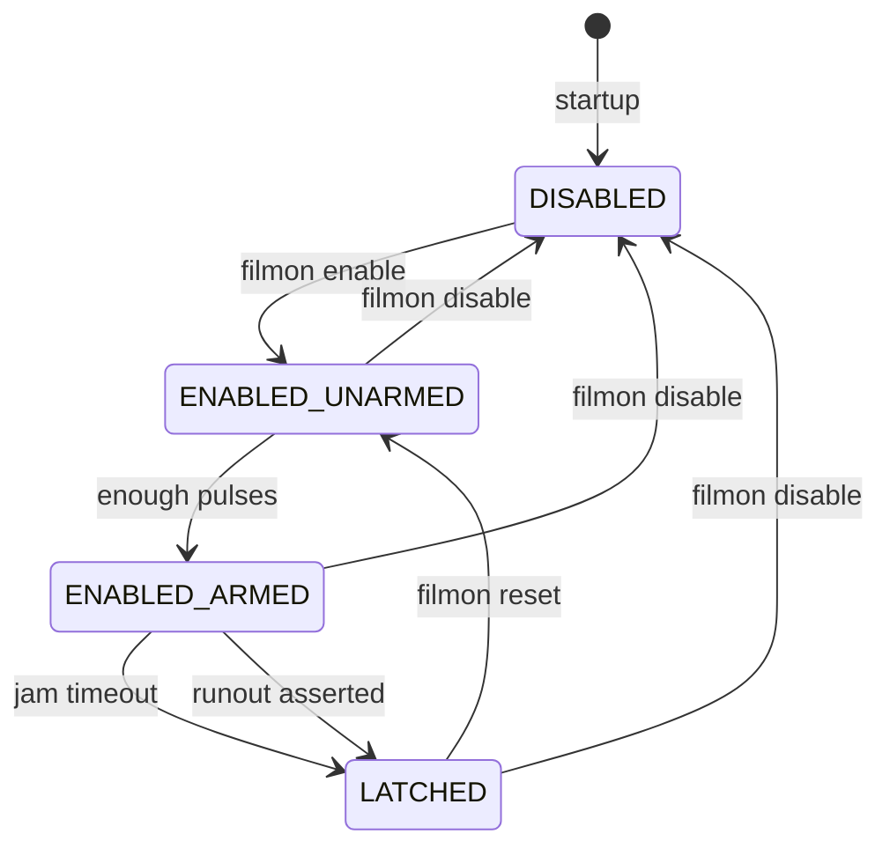

# Filament Motion & Runout Monitor (Marlin / Prusa firmware)

A Raspberry Pi daemon that monitors **filament motion pulses** and an optional **runout signal**, and issues a pause command when motion is expected but not observed.

> **Beta release**
>
> This is a **1.0.0-beta** release. The control interface (`filmon:*`) and the state model are considered stable,
> but the project is still gathering real-world feedback. Expect conservative defaults and incremental refinements.

This project is intended for **Marlin-based firmware**, including **Prusa firmware variants**.

## Table of Contents

<details>
<summary>Click to expand</summary>

- [Status](#status)
- [Quick start](#quick-start)
- [PrusaSlicer configuration](#prusaslicer-configuration)
  - [Start G-code](#start-g-code)
  - [Before and after layer change](#before-and-after-layer-change)
  - [End G-code](#end-g-code)
- [How it works](#how-it-works)
  - [State model](#state-model)
  - [Layer-change gating timeline](#layer-change-gating-timeline)
- [Command-line arguments](#command-line-arguments)
  - [Serial connection](#serial-connection)
  - [GPIO inputs](#gpio-inputs)
  - [Jam detection tuning](#jam-detection-tuning)
  - [Diagnostics and safety](#diagnostics-and-safety)
- [Installation](#installation)
  - [1) OS packages](#1-os-packages)
  - [2) Python dependencies](#2-python-dependencies)
- [GPIO backend selection](#gpio-backend-selection)
  - [Legacy backend: `python3-rpi.gpio`](#legacy-backend-python3-rpigpio)
  - [Modern backend (recommended on Debian Trixie and newer): `python3-rpi-lgpio`](#modern-backend-recommended-on-debian-trixie-and-newer-python3-rpi-lgpio)
- [Wiring](#wiring)
  - [Generic wiring](#generic-wiring)
  - [Example: BTT SFS v2 0](#example-btt-sfs-v2-0)
- [Usage](#usage)
- [Systemd service](#systemd-service)
- [Logging](#logging)
- [Known limitations](#known-limitations)
- [Troubleshooting](#troubleshooting)

</details>
## Status
Release status: **1.0.0-beta**

Control markers (sent via `M118 A1`):
- `filmon:enable`
- `filmon:disable`
- `filmon:reset`

## Quick start
```bash
python3 -m venv .venv
. .venv/bin/activate
pip install -r requirements.txt

# Optional: safe self-test (does not send M600)
python filament-monitor.py --self-test -p /dev/ttyACM0

# Run for real
python filament-monitor.py -p /dev/ttyACM0
```

## PrusaSlicer configuration

Use PrusaSlicer Custom G-code hooks to explicitly control when monitoring is active.

For an overview of the monitor’s internal states and why layer-change gating works, see **How it works → State model** below.

### Start G-code
Add these lines **immediately before your purge / first extrusion**:

```gcode
M118 A1 filmon:reset
M118 A1 filmon:enable
```

Recommended (defensive): add a disable near the top of Start G-code (helps if the monitor survives between prints):

```gcode
M118 A1 filmon:disable
```

### Before and after layer change
If your firmware does not echo positive extrusion (`E > 0`) to the serial console, the monitor cannot infer when extrusion is *expected*.
To avoid false jam detections during layer-change travel/Z moves, gate monitoring per layer:

- Disable monitoring before layer change (travel / Z lift / wipe / dwell).
- Re-enable monitoring **only once the printer is about to extrude**.

If you only have PrusaSlicer’s `AFTER_LAYER_CHANGE` hook, this still works **provided the monitor stays UNARMED until motion pulses are observed**
(or until extrusion is explicitly detected). If you see false jams immediately after `filmon:enable`, move the enable later (e.g. a hook right before
perimeters/infill) or increase the jam timeout.

```gcode
;BEFORE_LAYER_CHANGE
M118 A1 filmon:disable
```

**After layer change G-code**
```gcode
;AFTER_LAYER_CHANGE
M118 A1 filmon:enable
```

Optional per-layer reset (usually unnecessary):
```gcode
;AFTER_LAYER_CHANGE
M118 A1 filmon:reset
M118 A1 filmon:enable
```

### End G-code
Disable monitoring early in End G-code:

```gcode
M118 A1 filmon:disable
```

## How it works

### State model
The filament monitor operates as a small, explicit state machine. Understanding these states makes it easier to reason about false positives, layer-change behavior, and recovery after a pause.



**State legend**
- **DISABLED** — monitoring is off; motion and runout checks are ignored.
- **ENABLED_UNARMED** — enabled, but insufficient motion history has been observed to trust jam detection.
- **ENABLED_ARMED** — enabled and armed; jam/runout conditions can trigger a pause.
- **LATCHED** — a pause has been triggered; no further actions occur until reset.

Control marker mapping:
- *filmon enable* → `filmon:enable`
- *filmon disable* → `filmon:disable`
- *filmon reset* → `filmon:reset`

### Layer-change gating timeline
When firmware does not echo positive extrusion values (`E > 0`) to the serial console, the monitor cannot infer when extrusion is expected. PrusaSlicer layer-change hooks are therefore used to explicitly gate monitoring.

```
… extrusion …
   |
   |  BEFORE_LAYER_CHANGE  →  filmon:disable
   |  (travel / Z lift / wipe / dwell)
   |
   |  AFTER_LAYER_CHANGE   →  filmon:enable
   |
… extrusion …
```

This gating prevents false jam detections during non-extruding moves while still allowing fast detection once extrusion resumes.


## Command-line arguments

- Running with **no arguments** prints the built-in help and usage examples.
- `-h/--help` includes a short **Usage examples** section.

These options control how the monitor connects to the printer, interprets filament motion, and decides when to pause.
The table below is synced to the script’s `argparse` help strings.

### Serial connection

| Argument | Purpose | Default |
|---------|---------|---------|
| `-p, --port` | Serial device for the printer connection (e.g., /dev/ttyACM0). | `` |
| `--baud` | Serial baud rate for the printer connection (default: 115200). | `115200` |

### GPIO inputs

| Argument | Purpose | Default |
|---------|---------|---------|
| `--motion-gpio` | BCM GPIO pin number for the filament motion pulse input. | `26` |
| `--runout-enabled` | Enable runout monitoring (default: disabled). | `False` |
| `--runout-gpio` | BCM GPIO pin number for the optional runout input. | `27` |
| `--runout-debounce` | Debounce time (seconds) applied to the runout input to ignore short glitches. | `` |
| `--runout-active-high` | Treat the runout signal as active-high (default is active-low). | `False` |

### Jam detection tuning

| Argument | Purpose | Default |
|---------|---------|---------|
| `--arm-min-pulses` | Minimum motion pulses required before jam detection is armed. | `12` |
| `--jam-timeout` | Seconds without motion pulses (after arming) before declaring a jam (default: 8.0). | `8.0` |
| `--pause-gcode` | G-code to send when a jam/runout is detected (default: M600). | `M600` |

### Diagnostics and safety

| Argument | Purpose | Default |
|---------|---------|---------|
| `--doctor` | Run host/printer diagnostics (GPIO + serial checks) and exit. | `False` |
| `--self-test` | Dry-run mode: monitor inputs and parsing but do not send pause commands. | `False` |
| `--verbose` | Verbose logging (includes serial chatter). | `False` |
| `--no-banner` | Disable the startup banner. | `False` |
| `--version` | Print version and exit. | `False` |

Example (motion + optional runout):
```bash
python filament-monitor.py -p /dev/ttyACM0 \
  --motion-gpio 26 \
  --runout-enabled \
  --runout-gpio 27
```

## Installation


> **Note:** `pyserial` is required to connect to the printer over USB/serial.

All installation and configuration instructions are maintained in this README.


### 1) OS packages
```bash
sudo apt update
sudo apt install -y python3 python3-venv python3-pip python3-gpiozero
```

### 2) Python dependencies
From the project directory:
```bash
python3 -m venv .venv
. .venv/bin/activate
pip install -r requirements.txt
```

## GPIO backend selection

This project uses the `RPi.GPIO` API via `gpiozero`. On modern Linux distributions, choose **one** compatible backend:

### Legacy backend: `python3-rpi.gpio`
- Uses the legacy sysfs GPIO interface
- Works on older Raspberry Pi OS / Debian releases

```bash
sudo apt install -y python3-rpi.gpio python3-gpiozero
```

### Modern backend (recommended on Debian Trixie and newer): `python3-rpi-lgpio`
- Uses the modern `gpiochip` interface
- Drop-in compatible with `RPi.GPIO`
- Recommended for Debian Trixie and newer

```bash
sudo apt remove -y python3-rpi.gpio
sudo apt install -y python3-rpi-lgpio python3-gpiozero
```

> Note: `python3-rpi.gpio` and `python3-rpi-lgpio` cannot be installed at the same time. Choose exactly one backend.

## Wiring

### Generic wiring
You need:
- one **motion pulse** signal (digital)
- optional **runout** signal (digital)
- **GND**
- sensor logic compatible with **3.3V GPIO**

### Example: BTT SFS v2 0
Common reference wiring (BCM numbering):

```
BTT SFS v2.0            Raspberry Pi (BCM)
------------------------------------------
GND        ---------->  GND
SIG (PULSE)---------->  GPIO 26   (motion)
SW (RUNOUT)---------->  GPIO 27   (optional runout)
VCC        ---------->  3.3V
```

Notes:
- Use **BCM** numbers (e.g., 26/27), not physical pin numbers
- Do **not** use 5V logic on GPIO pins
- The runout input is optional

## Usage

Typical command line:
```bash
python filament-monitor.py -p /dev/ttyACM0 --motion-gpio 26 --runout-gpio 27 --runout-active-high
```

For help:
```bash
python filament-monitor.py -h
```

## Systemd service

The included `filament-monitor.service` is a template. **Edit `WorkingDirectory` and `ExecStart`** to match where you installed the project and which serial/GPIO arguments you want.

A sample service file is included as `filament-monitor.service`.

Typical install:
```bash
sudo cp filament-monitor.service /etc/systemd/system/
sudo systemctl daemon-reload
sudo systemctl enable --now filament-monitor.service
```

## Logging
The monitor emits single-line JSON events to stdout. When run under systemd, view logs with:

```bash
journalctl -u filament-monitor.service -f
```

## Known limitations

- **Extrusion expectation is slicer-signaled.** If your firmware does not echo positive extrusion moves (`E > 0`)
  to the serial console, the monitor cannot infer “extrusion expected” from G-code alone. Use PrusaSlicer
  **Before layer change** / **After layer change** hooks (`filmon:disable` / `filmon:enable`) to avoid false jam triggers.
- **Pulse-based motion sensors only.** The monitor expects a digital pulse stream correlated with filament motion.
  Sensors that only provide a static “present/not present” signal cannot detect jams.
- **Layer-change and non-extruding moves.** If monitoring is left enabled during travel/Z-lift/wipe/dwell sequences,
  the lack of pulses may be interpreted as a jam depending on timeout settings.
- **GPIO backend selection is platform-dependent.** On newer Debian releases (e.g., Trixie), `python3-rpi-lgpio`
  is typically the correct backend; on older systems, `python3-rpi.gpio` may work better. Only one backend can be installed.
- **Not a substitute for firmware safety features.** This tool augments firmware behavior but cannot detect all failure modes
  (e.g., partial clogs that still generate some pulses, or mechanical slip without pulse loss depending on sensor placement).


## Troubleshooting
- If you get no pulse events, confirm wiring, BCM numbering, and that your GPIO backend is installed.
- If you see false jams during layer changes, confirm PrusaSlicer Before/After layer change hooks are installed and emitting `M118 A1 filmon:disable` / `filmon:enable`.
- If serial control markers are not observed, confirm the printer echoes `M118` messages to the console.


\1
#### Integration tests (virtual serial)

Integration tests are marked with `@pytest.mark.integration` and are **not** run by default.

Run them locally:

```bash
DD_TRACE_ENABLED=false pytest -q -m integration
```

On GitHub Actions, integration tests run via the manual workflow (**Actions → integration → Run workflow**).

### Running unit tests

> **Note on `ddtrace`:** On some systems, automatic `ddtrace` instrumentation can interfere with `pytest` (tests may hang or fail to import). If you encounter issues, disable it explicitly when running tests:

```bash
DD_TRACE_ENABLED=false pytest
```

This does not affect normal operation of `filament-monitor`.

---

## Design Philosophy (Jam-Resistant Operation)

This monitor is intentionally conservative:

- False positives are considered worse than delayed detection
- Monitoring must be explicitly enabled via slicer or G-code markers
- Motion expectation is derived from *actual commanded extrusion*
- Jam detection requires multiple invariants to be violated simultaneously

The goal is predictable, reviewable behavior rather than aggressive detection.

---

## Safety Invariants

The following invariants are enforced by both runtime logic and unit tests:

- Jam timers do **not** start until valid filament motion has been observed
- `filmon:disable` or `filmon:reset` immediately cancels all active timers
- Duplicate enable/disable markers are idempotent
- GPIO callbacks are ignored once shutdown begins
- A triggered pause blocks further detection until reset

If any invariant cannot be satisfied, the monitor fails safe.

---

## Pause Latch Behavior

When a jam or runout is detected:

1. A single pause command (default: `M600`) is issued
2. The monitor enters a **latched** state
3. No additional pause commands are sent
4. Jam detection remains disabled until `filmon:reset`

This latch is explicitly tested to prevent repeated pause commands
(“jam storms”) during recovery or user intervention.
