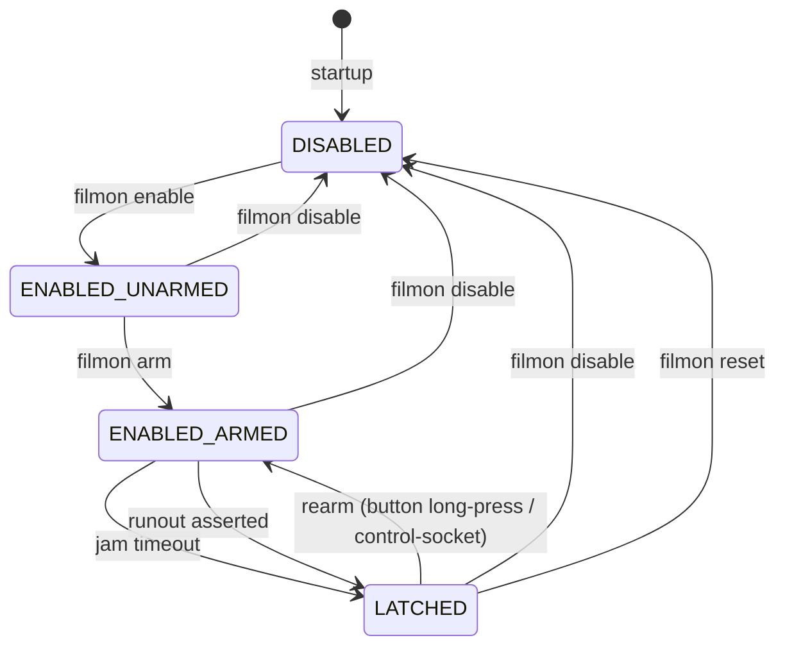
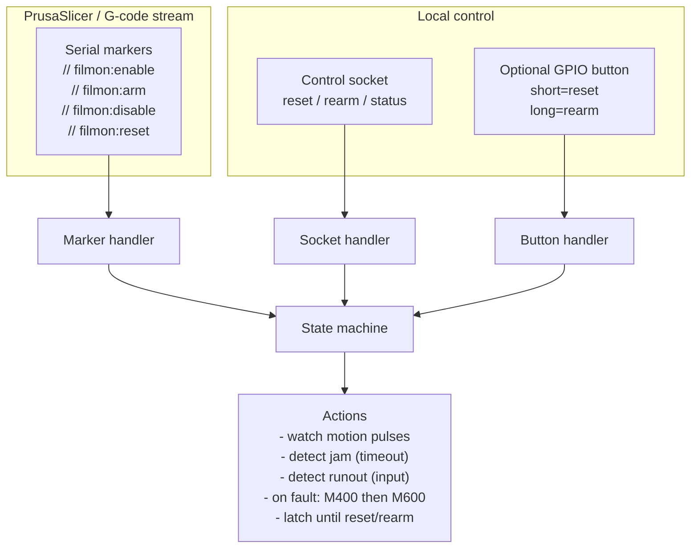

# Usage

[Back to README](../README.md)

### Related documentation
- [Usage](USAGE.md)
- [Marlin / G-code Integration](INTEGRATION.md)
- [Deployment & Architecture](DEPLOYMENT.md)

---

## Table of Contents

<details>
<summary>Click to expand</summary>

- [Status](#status)
- [Quick start](#quick-start)
- [PrusaSlicer configuration](#prusaslicer-configuration)
  - [Start G-code](#start-g-code)
  - [Before and after layer change](#before-and-after-layer-change)
  - [End G-code](#end-g-code)
- [How it works](#how-it-works)
  - [State model](#state-model)
  - [Layer-change gating timeline](#layer-change-gating-timeline)
- [Command-line arguments](#command-line-arguments)
  - [Serial connection](#serial-connection)
  - [GPIO inputs](#gpio-inputs)
  - [Jam detection tuning](#jam-detection-tuning)
  - [Diagnostics and safety](#diagnostics-and-safety)
- [Installation](#installation)
  - [1) OS packages](#1-os-packages)
  - [2) Python dependencies](#2-python-dependencies)
- [GPIO backend selection](#gpio-backend-selection)
  - [Legacy backend: `python3-rpi.gpio`](#legacy-backend-python3-rpigpio)
  - [Modern backend (recommended on Debian Trixie and newer): `python3-rpi-lgpio`](#modern-backend-recommended-on-debian-trixie-and-newer-python3-rpi-lgpio)
- [Wiring](#wiring)
  - [Generic wiring](#generic-wiring)
  - [Example: BTT SFS v2 0](#example-btt-sfs-v2-0)
- [Usage](#usage)
- [Systemd service](#systemd-service)
- [Logging](#logging)
- [Known limitations](#known-limitations)
- [Troubleshooting](#troubleshooting)
- [Design Philosophy (Jam-Resistant Operation)](#design-philosophy-jam-resistant-operation)
- [Safety Invariants](#safety-invariants)
- [Pause Latch Behavior](#pause-latch-behavior)

</details>

## Status
Release status: **1.0.0-beta**

Control markers (sent via `M118 A1`):
- `filmon:enable`
- `filmon:disable`
- `filmon:reset`
 - `filmon:arm`
 - `filmon:unarm`

## Quick start
```
bash
python3 -m venv .venv
. .venv/bin/activate
pip install -r requirements.txt

# Optional: safe self-test (does not send M600)
python filament-monitor.py --self-test -p /dev/ttyACM0

# Run for real
python filament-monitor.py -p /dev/ttyACM0
```

## PrusaSlicer configuration


### Marker-only arming (recommended)

Jam/runout detection is **marker-driven** to prevent false positives ("jam storms").
The monitor will **never** declare a jam or runout unless you explicitly arm it.

Use these markers (sent via `M118 A1 ...`):

- `filmon:reset`  — clears latch/counters and disables monitoring
- `filmon:enable` — enables monitoring (unarmed; safe during travel/heatup)
- `filmon:arm`    — enables monitoring and arms jam/runout detection
- `filmon:unarm`  — keeps enabled but disarms detection
- `filmon:disable`— disables monitoring

Recommended pattern (production-safe):
- In **Start G-code**: `reset`, then `enable` (**do not arm on layer 1**)
- In **Before layer change G-code**: arm at the start of **layer 2**
- In **End G-code**: `disable`

Why not arm on layer 1?
- First-layer behavior often includes very low flow, short segments, and pauses.
- With pulse-based sensors (e.g. BTT SFS v2.0 at ~2.88 mm/pulse), legitimate extrusion can occur with long gaps between pulses.
  Arming during ultra-low flow can therefore cause premature pauses.

Use PrusaSlicer Custom G-code hooks to explicitly control when monitoring is active.

For an overview of the monitor’s internal states and why layer-change gating works, see **How it works → State model** below.

### Start G-code
Add these lines in Start G-code (before printing begins):

```
gcode
M118 A1 filmon:reset
M118 A1 filmon:enable
```

Recommended (defensive): add a disable near the top of Start G-code (helps if the monitor survives between prints):

```
gcode
M118 A1 filmon:disable
```

### Before layer change (arming policy)

Arm exactly once at the start of **layer 2** (PrusaSlicer `layer_num` is zero-based: 0=layer 1, 1=layer 2):

```
gcode
;BEFORE_LAYER_CHANGE
{if layer_num==1}M118 A1 filmon:arm{endif}
```

This pattern is robust for normal printing flows, including frequent retractions and travel moves.

Optional: if you have known ultra-low-flow features where pulses may be very sparse, bracket them with `filmon:unarm` / `filmon:arm`.

### End G-code
Disable monitoring early in End G-code:

```
gcode
M118 A1 filmon:disable
```

## How it works

### State model
The filament monitor operates as a small, explicit state machine. Understanding these states makes it easier to reason about false positives, layer-change behavior, and recovery after a pause.

### State model
The filament monitor operates as a small, explicit state machine. Understanding these states makes it easier to reason about false positives, layer-change behavior, and recovery after a pause.



**Notes (matches the implementation):**
- **`filmon:reset` returns to `DISABLED`** (clears latch/counters and disables monitoring).
- **`rearm` clears the latch and returns to `ENABLED_ARMED`** (enabled + armed). This can be triggered via the control socket, and (if configured) a **long press** on the rearm button.
- While **`LATCHED`**, additional jam/runout detections are ignored until you `reset` or `rearm`.

### Control inputs (markers, socket, button)

The monitor can be controlled from multiple sources; they converge on the same state transitions.




**State legend**
- **DISABLED** — monitoring is off; motion and runout checks are ignored.
- **ENABLED_UNARMED** — enabled but unarmed; safe during travel, heatup, and ultra-low-flow segments.
- **ENABLED_ARMED** — enabled and armed; jam/runout conditions can trigger a pause.
- **LATCHED** — a pause has been triggered; no further actions occur until reset.

Control marker mapping:
- *filmon enable* → `filmon:enable`
- *filmon disable* → `filmon:disable`
- *filmon reset* → `filmon:reset`

### Layer-change gating timeline
Recommended arming timeline:

```
Start G-code:    filmon:reset, filmon:enable   (unarmed)
Layer 2 start:   filmon:arm
End G-code:      filmon:disable
```

## Command-line arguments

- Running with **no arguments** prints the built-in help and usage examples.
- `-h/--help` includes a short **Usage examples** section.

These options control how the monitor connects to the printer, interprets filament motion, and decides when to pause.
The table below is synced to the script’s `argparse` help strings.

### Serial connection

| Argument | Purpose | Default |
|---------|---------|---------|
| `-p, --port` | Serial device for the printer connection (e.g., /dev/ttyACM0). | `` |
| `--baud` | Serial baud rate for the printer connection (default: 115200). | `115200` |

### GPIO inputs

| Argument | Purpose | Default |
|---------|---------|---------|
| `--motion-gpio` | BCM GPIO pin number for the filament motion pulse input. | `26` |
| `--runout-enabled` | Enable runout monitoring (default: disabled). | `False` |
| `--runout-gpio` | BCM GPIO pin number for the optional runout input. | `27` |
| `--runout-debounce` | Debounce time (seconds) applied to the runout input to ignore short glitches. | `` |
| `--runout-active-high` | Treat the runout signal as active-high (default is active-low). | `False` |

### Jam detection tuning

| Argument | Purpose | Default |
|---------|---------|---------|
| `--arm-min-pulses` | (Legacy/unused) Jam detection is marker-driven via `filmon:arm`. | `12` |
| `--jam-timeout` | Seconds without motion pulses (after arming) before declaring a jam (default: 8.0). | `8.0` |
| `--pause-gcode` | G-code to send when a jam/runout is detected (default: M600). | `M600` |

### Diagnostics and safety

| Argument | Purpose | Default |
|---------|---------|---------|
| `--doctor` | Run host/printer diagnostics (GPIO + serial checks) and exit. | `False` |
| `--self-test` | Dry-run mode: monitor inputs and parsing but do not send pause commands. | `False` |
| `--verbose` | Verbose logging (includes serial chatter). | `False` |
| `--json` | Emit structured JSON log events (one per line). | `False` |
| `--no-json` | Disable JSON log output. | `False` |
| `--no-banner` | Disable the startup banner. | `False` |
| `--version` | Print version and exit. | `False` |
| `--config` | Path to a TOML config file (CLI overrides config). | `` |
| `--print-config` | Print the resolved configuration and exit. | `False` |

Example (motion + optional runout):
```
bash
python filament-monitor.py -p /dev/ttyACM0 \
  --motion-gpio 26 \
  --runout-enabled \
  --runout-gpio 27
```

## Installation


> **Note:** `pyserial` is required to connect to the printer over USB/serial.

All installation and configuration instructions are maintained in this README.


### 1) OS packages
```
bash
sudo apt update
sudo apt install -y python3 python3-venv python3-pip python3-gpiozero
```

### 2) Python dependencies
From the project directory:
```
bash
python3 -m venv .venv
. .venv/bin/activate
pip install -r requirements.txt
```

## Optional: Rearm Button (GPIO)

You can configure an optional **physical rearm button** on a GPIO pin. This is a convenience feature for clearing a
latched fault locally (e.g., after an `M600` pause) without needing to send `filmon:reset` / `filmon:arm` over serial.

- **Optional:** if not configured, the monitor behaves normally.
- **Active-low (recommended):** wire a momentary switch between the GPIO pin and **GND** (the monitor enables an internal pull-up).
- **Debounced:** presses are debounced to avoid accidental multiple actions.
- **State model:** intended for recovery after a fault has latched; it does not replace the marker-driven enable/arm workflow.

**Button actions:**
- **Short press:** `reset` (same semantics as `filmon:reset`: clears latch/counters and disables monitoring)
- **Long press:** `rearm` (clears latch and arms detection; equivalent to the control-socket `rearm` command)

### Config (TOML)

In `config.toml` (see `config.example.toml`):

```toml
[gpio]
rearm_button_gpio = 25
rearm_button_debounce = 0.25
rearm_button_long_press = 1.5
```

### CLI

```bash
python filament-monitor.py \
  --rearm-button-gpio 25 \
  --rearm-button-debounce 0.25 \
  --rearm-button-long-press 1.5
```

## Usage

Typical command line:
```
bash
python filament-monitor.py -p /dev/ttyACM0 --motion-gpio 26 --runout-gpio 27 --runout-active-high
```

For help:
```
bash
python filament-monitor.py -h
```

## Configuration (TOML)

Use a TOML file to keep systemd `ExecStart` short.

**Precedence:** CLI arguments override TOML values, which override built-in defaults.

Start from `config.example.toml`:

```
bash
cp config.example.toml /etc/filmon/config.toml
```

Run:

```
bash
python filament-monitor.py --config /etc/filmon/config.toml
```

Show the resolved configuration:

```
bash
python filament-monitor.py --config /etc/filmon/config.toml --print-config
```

## Logging
The monitor can emit either:

- **Human-readable** logs (default) with millisecond timestamps
- **JSON Lines** (one JSON object per line) with `--json` (recommended for analysis)

Breadcrumbs:
- `--verbose` enables **heartbeat** (`hb`) and **stall** breadcrumbs to help tune timeouts.
- Default heartbeat interval: **2s**
- Default stall thresholds: **3s, 6s** (seconds since last pulse while armed)

When run under systemd, view logs with:

```
bash
journalctl -u filament-monitor.service -f
```

## Diagnostic Breadcrumb Logging

The monitor supports **breadcrumb logging** to provide low-rate, aggregated insight into filament motion without logging every sensor pulse. Breadcrumbs are intended for **tuning, validation, and post‑mortem analysis**, not for normal production logging.

Breadcrumbs are **disabled by default** and are automatically enabled when running with `--verbose`.

### Emitted breadcrumb events

**`hb` — Heartbeat**  
Emitted periodically while the monitor is enabled (default: every 2 seconds).

Includes:
- `dt_since_pulse` — seconds since the last motion pulse
- `pps` — pulses per second over a sliding window
- `pulses_reset` — pulses since last reset
- `enabled`, `armed`, `latched` — current state

Used to establish normal pulse cadence and measure worst‑case legitimate pulse gaps.

**`stall` — Stall breadcrumb**  
Emitted when `dt_since_pulse` exceeds configured thresholds **while armed**.

Defaults: `3s`, `6s`

Used to observe pulse starvation leading up to a jam and to verify that retract/travel patterns do **not** cause false triggers.

**`first_pulse_after_arm`**  
Emitted once after arming, when the first motion pulse is observed. Confirms correct arming placement and sensor engagement.

**`pause_triggered`**  
When a jam or runout is detected, the pause event includes breadcrumb evidence such as `dt_since_pulse`, `pps`, and pulse counters.

### Breadcrumb-related command-line options

```
--verbose
    Enable diagnostic logging, including breadcrumb events (hb, stall, etc).

--breadcrumb-interval SECONDS
    Heartbeat interval while enabled (default: 2.0).
    Set to 0 to disable heartbeat breadcrumbs.

--stall-thresholds SECONDS[,SECONDS...]
    Comma-separated list of stall thresholds in seconds.
    Default: 3,6

--pulse-window SECONDS
    Sliding window used to compute pulses-per-second (pps).
    Default: 2.0
```

### Log formats

Breadcrumbs are available in both log formats:

- **Human-readable logs**
  - Millisecond timestamps
  - Suitable for live inspection (`tail -f`)
- **JSON logs (`--json`)**
  - Recommended for analysis and tooling
  - Stable field names
  - One JSON object per line (JSONL)

Breadcrumbs indicate **observed conditions**, not errors. A stall breadcrumb does not imply a jam; it simply records a period without detected filament motion.

## Troubleshooting
- If you get no pulse events, confirm wiring, BCM numbering, and that your GPIO backend is installed.
- If you see premature pauses at very low flow, do not arm on layer 1; arm at layer 2 and/or unarm during ultra-low-flow features.
- If serial control markers are not observed, confirm the printer echoes `M118` messages to the console.

#### Integration tests (virtual serial)

Integration tests are marked with `@pytest.mark.integration` and are **not** run by default.

Run them locally:

```
bash
DD_TRACE_ENABLED=false pytest -q -m integration
```

On GitHub Actions, integration tests run via the manual workflow (**Actions → integration → Run workflow**).

### Running unit tests

> **Note on `ddtrace`:** On some systems, automatic `ddtrace` instrumentation can interfere with `pytest` (tests may hang or fail to import). If you encounter issues, disable it explicitly when running tests:

```
bash
DD_TRACE_ENABLED=false pytest
```

This does not affect normal operation of `filament-monitor`.

---

## Safety Invariants

The following invariants are enforced by both runtime logic and unit tests:

- Jam timers do **not** start until valid filament motion has been observed
- `filmon:disable` or `filmon:reset` immediately cancels all active timers
- Duplicate enable/disable markers are idempotent
- GPIO callbacks are ignored once shutdown begins
- A triggered pause blocks further detection until reset

If any invariant cannot be satisfied, the monitor fails safe.

---

## Default Parameters

The following defaults are chosen to balance detection latency and false-positive resistance:

- `jam_timeout_s`: **8.0**
- `stall_thresholds`: **3,6**
- `breadcrumb_interval`: **2.0**
- `pulse_window`: **2.0**

These values are validated for typical PLA printing with a 0.4 mm nozzle and normal perimeter/infill speeds. Adjust only after reviewing breadcrumb data.

If the daemon owns the printer serial port, you can re-arm after clearing a jam using a physical button wired to a Raspberry Pi GPIO.

- `--rearm-button-gpio BCM_PIN` (example: `25`)
- `--rearm-button-active-high` (default) or `--rearm-button-active-low`
- `--rearm-button-debounce SECONDS` (default: `0.25`)

The button triggers the same action as `filmonctl rearm`: clears the latch, resets counters, and arms detection.


### Physical rearm button (active-low)
- Wire the button between **GPIO 25 and GND**
- The input uses an internal pull-up
- Pressing the button pulls the pin low and triggers a rearm
- Debounce is handled in software

Configuration:
```
toml
[gpio]
rearm_button_gpio = 25
rearm_button_active_high = false
rearm_button_debounce
rearm_button_long_press = 0.25
```
