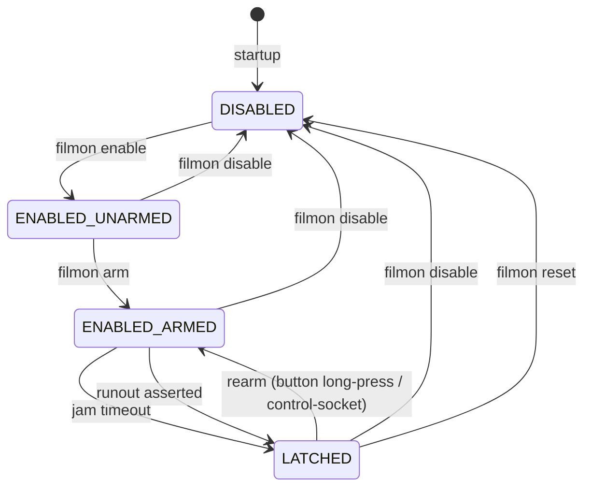
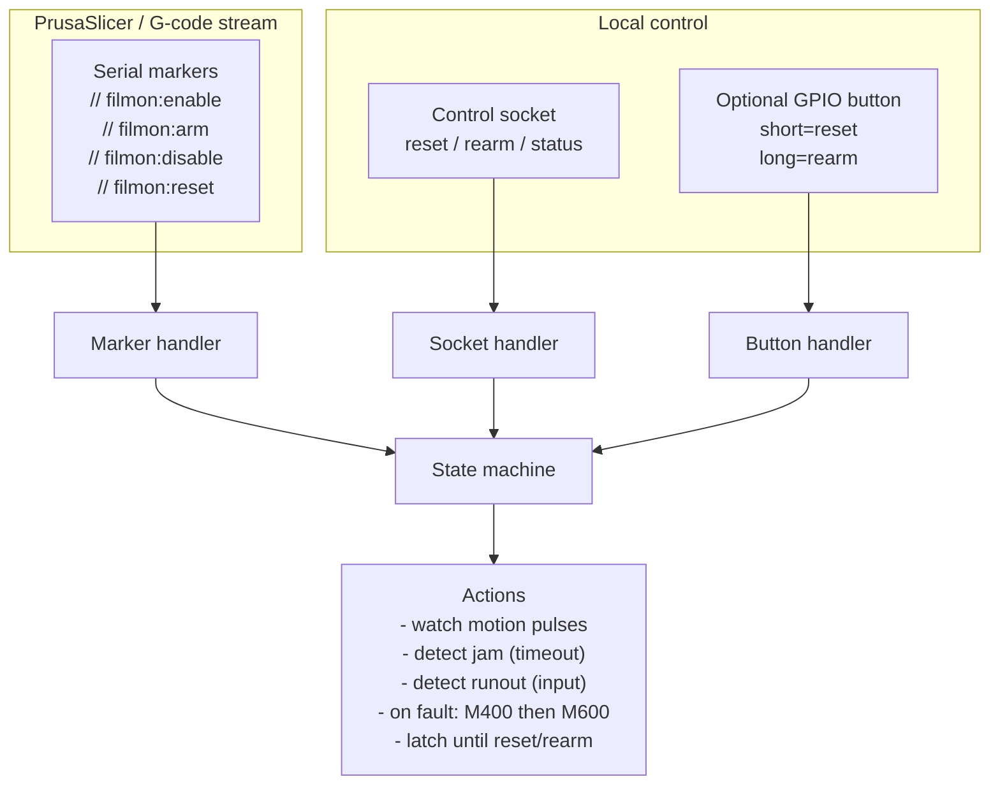

# Usage

[Back to README](../README.md)

### Related documentation
- [Usage](USAGE.md)
- [Marlin / G-code Integration](INTEGRATION.md)
- [Deployment & Architecture](DEPLOYMENT.md)

---

## Table of Contents

<details>
<summary>Click to expand</summary>

- [Status](#status)
- [Quick start](#quick-start)
- [PrusaSlicer configuration](#prusaslicer-configuration)
  - [Start G-code](#start-g-code)
  - [Before and after layer change](#before-and-after-layer-change)
  - [End G-code](#end-g-code)
- [How it works](#how-it-works)
  - [State model](#state-model)
  - [Layer-change gating timeline](#layer-change-gating-timeline)
- [Command-line arguments](#command-line-arguments)
  - [Serial connection](#serial-connection)
  - [GPIO inputs](#gpio-inputs)
  - [Jam detection tuning](#jam-detection-tuning)
  - [Diagnostics and safety](#diagnostics-and-safety)
- [Installation](#installation)
  - [1) OS packages](#1-os-packages)
  - [2) Python dependencies](#2-python-dependencies)
- [GPIO backend selection](#gpio-backend-selection)
  - [Legacy backend: `python3-rpi.gpio`](#legacy-backend-python3-rpigpio)
  - [Modern backend (recommended on Debian Trixie and newer): `python3-rpi-lgpio`](#modern-backend-recommended-on-debian-trixie-and-newer-python3-rpi-lgpio)
- [Wiring](#wiring)
  - [Generic wiring](#generic-wiring)
  - [Example: BTT SFS v2 0](#example-btt-sfs-v2-0)
- [Usage](#usage)
- [Systemd service](#systemd-service)
- [Logging](#logging)
- [Known limitations](#known-limitations)
- [Troubleshooting](#troubleshooting)
- [Design Philosophy (Jam-Resistant Operation)](#design-philosophy-jam-resistant-operation)
- [Safety Invariants](#safety-invariants)
- [Pause Latch Behavior](#pause-latch-behavior)

</details>

## Status
Release status: **1.0.0-beta**

Control markers (sent via `M118 A1`):
- `filmon:enable`
- `filmon:disable`
- `filmon:reset`
 - `filmon:arm`
 - `filmon:unarm`

## Quick start
```
bash
python3 -m venv .venv
. .venv/bin/activate
pip install -r requirements.txt

# Optional: safe self-test (does not send M600)
python filament-monitor.py --self-test -p /dev/ttyACM0

# Run for real
python filament-monitor.py -p /dev/ttyACM0
```

## PrusaSlicer configuration


### Marker-only arming (recommended)

Jam/runout detection is **marker-driven** to prevent false positives ("jam storms").
The monitor will **never** declare a jam or runout unless you explicitly arm it.

Use these markers (sent via `M118 A1 ...`):

- `filmon:reset`  — clears latch/counters and disables monitoring
- `filmon:enable` — enables monitoring (unarmed; safe during travel/heatup)
- `filmon:arm`    — enables monitoring and arms jam/runout detection
- `filmon:unarm`  — keeps enabled but disarms detection
- `filmon:disable`— disables monitoring

Recommended pattern (production-safe):
- In **Start G-code**: `reset`, then `enable` (**do not arm on layer 1**)
- In **Before layer change G-code**: arm at the start of **layer 2**
- In **End G-code**: `disable`

Why not arm on layer 1?
- First-layer behavior often includes very low flow, short segments, and pauses.
- With pulse-based sensors (e.g. BTT SFS v2.0 at ~2.88 mm/pulse), legitimate extrusion can occur with long gaps between pulses.
  Arming during ultra-low flow can therefore cause premature pauses.

Use PrusaSlicer Custom G-code hooks to explicitly control when monitoring is active.

For an overview of the monitor’s internal states and why layer-change gating works, see **How it works → State model** below.

### Start G-code
Add these lines in Start G-code (before printing begins):

```
gcode
M118 A1 filmon:reset
M118 A1 filmon:enable
```

Recommended (defensive): add a disable near the top of Start G-code (helps if the monitor survives between prints):

```
gcode
M118 A1 filmon:disable
```

### Before layer change (arming policy)

Arm exactly once at the start of **layer 2** (PrusaSlicer `layer_num` is zero-based: 0=layer 1, 1=layer 2):

```
gcode
;BEFORE_LAYER_CHANGE
{if layer_num==1}M118 A1 filmon:arm{endif}
```

This pattern is robust for normal printing flows, including frequent retractions and travel moves.

Optional: if you have known ultra-low-flow features where pulses may be very sparse, bracket them with `filmon:unarm` / `filmon:arm`.

### End G-code
Disable monitoring early in End G-code:

```
gcode
M118 A1 filmon:disable
```

## How it works

### State model
The filament monitor operates as a small, explicit state machine. Understanding these states makes it easier to reason about false positives, layer-change behavior, and recovery after a pause.

### State model
The filament monitor operates as a small, explicit state machine. Understanding these states makes it easier to reason about false positives, layer-change behavior, and recovery after a pause.



**Notes (matches the implementation):**
- **`filmon:reset` returns to `DISABLED`** (clears latch/counters and disables monitoring).
- **`rearm` clears the latch and returns to `ENABLED_ARMED`** (enabled + armed). This can be triggered via the control socket, and (if configured) a **long press** on the rearm button.
- While **`LATCHED`**, additional jam/runout detections are ignored until you `reset` or `rearm`.

### Control inputs (markers, socket, button)

The monitor can be controlled from multiple sources; they converge on the same state transitions.




**State legend**
- **DISABLED** — monitoring is off; motion and runout checks are ignored.
- **ENABLED_UNARMED** — enabled but unarmed; safe during travel, heatup, and ultra-low-flow segments.
- **ENABLED_ARMED** — enabled and armed; jam/runout conditions can trigger a pause.
- **LATCHED** — a pause has been triggered; no further actions occur until reset.

Control marker mapping:
- *filmon enable* → `filmon:enable`
- *filmon disable* → `filmon:disable`
- *filmon reset* → `filmon:reset`

### Layer-change gating timeline
Recommended arming timeline:

```
Start G-code:    filmon:reset, filmon:enable   (unarmed)
Layer 2 start:   filmon:arm
End G-code:      filmon:disable
```

## Command-line arguments

- Running with **no arguments** prints the built-in help and usage examples.
- `-h/--help` includes a short **Usage examples** section.

These options control how the monitor connects to the printer, interprets filament motion, and decides when to pause.
The table below is synced to the script’s `argparse` help strings.

### Serial connection

| Argument | Purpose | Default |
|---------|---------|---------|
| `-p, --port` | Serial device for the printer connection (e.g., /dev/ttyACM0). | `` |
| `--baud` | Serial baud rate for the printer connection (default: 115200). | `115200` |

### GPIO inputs

| Argument | Purpose | Default |
|---------|---------|---------|
| `--motion-gpio` | BCM GPIO pin number for the filament motion pulse input. | `26` |
| `--runout-enabled` | Enable runout monitoring (default: disabled). | `False` |
| `--runout-gpio` | BCM GPIO pin number for the optional runout input. | `27` |
| `--runout-debounce` | Debounce time (seconds) applied to the runout input to ignore short glitches. | `` |
| `--runout-active-high` | Treat the runout signal as active-high (default is active-low). | `False` |

### Jam detection tuning

| Argument | Purpose | Default |
|---------|---------|---------|
| `--arm-min-pulses` | (Legacy/unused) Jam detection is marker-driven via `filmon:arm`. | `12` |
| `--jam-timeout` | **Base** jam timeout: seconds without motion pulses (after arming) before declaring a jam. | `8.0` |
| `--pause-gcode` | G-code to send when a jam/runout is detected. | `M600` |

### Adaptive jam timeout (config-only)

For prints with very slow or intermittent extrusion (common near end-of-print), a fixed `--jam-timeout` can cause false jams.
You can enable an **adaptive** jam timeout that scales with the recent pulse rate (pps) and is clamped within bounds.

Add to your config under `[detection]`:

```toml
# Enable adaptive jam timeout (pps-based)
jam_timeout_adaptive = true

# Clamp range for the effective timeout (seconds)
jam_timeout_min = 6.0
jam_timeout_max = 18.0

# Scale factor: effective_timeout ≈ jam_timeout_k / max(pps_ema, jam_timeout_pps_floor)
jam_timeout_k = 16.0
jam_timeout_pps_floor = 0.3

# EMA half-life (seconds) for smoothing pps
jam_timeout_ema_halflife = 3.0
```

The monitor will include `pps_ema` and `jam_timeout_effective_s` in the heartbeat JSON.

### Post-(re)arm grace period (config-only)

To prevent an immediate false jam right after `filmon:arm` or a rearm action, you can configure a grace gate.
Jam latching is suppressed until either condition is met:

- at least `arm_grace_pulses` pulses have been observed since (re)arm, **or**
- at least `arm_grace_s` seconds have elapsed since (re)arm

Example:

```toml
arm_grace_pulses = 12
arm_grace_s = 12.0
```

### Diagnostics and safety

| Argument | Purpose | Default |
|---------|---------|---------|
| `--doctor` | Run host/printer diagnostics (GPIO + serial checks) and exit. | `False` |
| `--self-test` | Dry-run mode: monitor inputs and parsing but do not send pause commands. | `False` |
| `--verbose` | Verbose logging (includes serial chatter). | `False` |
| `--json` | Emit structured JSON log events (one per line). | `False` |
| `--no-json` | Disable JSON log output. | `False` |
| `--no-banner` | Disable the startup banner. | `False` |

## Installation


> **Note:** `pyserial` is required to connect to the printer over USB/serial.

All installation and configuration instructions are maintained in this README.


### 1) OS packages
```
bash
sudo apt update
sudo apt install -y python3 python3-venv python3-pip python3-gpiozero
```

### 2) Python dependencies
From the project directory:
```
bash
python3 -m venv .venv
. .venv/bin/activate
pip install -r requirements.txt
```

## Optional: Rearm Button (GPIO)

You can configure an optional **physical rearm button** on a GPIO pin. This is a convenience feature for clearing a
latched fault locally (e.g., after an `M600` pause) without needing to send `filmon:reset` / `filmon:arm` over serial.

- **Optional:** if not configured, the monitor behaves normally.
- **Active-low (recommended):** wire a momentary switch between the GPIO pin and **GND** (the monitor enables an internal pull-up).
- **Debounced:** presses are debounced to avoid accidental multiple actions.
- **State model:** intended for recovery after a fault has latched; it does not replace the marker-driven enable/arm workflow.

**Button actions:**
- **Short press:** `reset` (same semantics as `filmon:reset`: clears latch/counters and disables monitoring)
- **Long press:** `rearm` (clears latch and arms detection; equivalent to the control-socket `rearm` command)

### Config (TOML)

In `config.toml` (see `config.example.toml`):

```toml
[gpio]
rearm_button_gpio = 25
rearm_button_debounce = 0.25
rearm_button_long_press = 1.5
```


### CLI

```bash
python filament-monitor.py \
  --rearm-button-gpio 25 \
  --rearm-button-long-press 1.5 \
  --rearm-button-debounce 0.25
```

Supported options:

- `--rearm-button-gpio BCM_PIN`  
  GPIO pin connected to the button.

- `--rearm-button-long-press SECONDS`  
  Duration that distinguishes a *long press* from a *short press*.

- `--rearm-button-debounce SECONDS`  
  Software debounce interval applied after button release.

There are **no CLI flags** to control button polarity.

#### Button polarity (config-only)

Button polarity is configured **only via the config file**:

```toml
rearm_button_active_high = false
```

- `false` (default): active-low (recommended)
- `true`: active-high

If omitted, the monitor assumes an active-low button.

Configuration:
```
toml
[gpio]
rearm_button_gpio = 25
rearm_button_active_high = false
rearm_button_debounce
rearm_button_long_press = 0.25
```


### run_doctor

`run_doctor` performs a set of read-only diagnostics to validate wiring and configuration.

If a rearm button is configured, `run_doctor` will additionally:

- verify the button input is stable when idle
- prompt for a **short press** (reset)
- prompt for a **long press** (rearm)

This interactive test **does not change monitor state, pause prints, or send any G-code**.


### Rearm button behavior

When a rearm button is configured:

- **Short press** → reset  
  Clears any latched fault and disables monitoring.

- **Long press** → rearm  
  Clears any latched fault and returns the monitor to an enabled + armed state.

This behavior is validated by `run_doctor` and exercised by the integration tests.


### Testing

The integration test suite simulates:

- Marlin-style serial streams
- GPIO motion pulses
- filament jam detection
- resume activity
- rearm button presses
- filament runout

Run integration tests with:

```bash
pytest -m integration
```

## Arming vs runout

- **Jam detection** is only evaluated while monitoring is **enabled and armed**.
- **Runout detection** is evaluated whenever monitoring is **enabled** (it does **not** require arm).

This mirrors practical usage: runout is a simple presence switch, while jam detection needs to be armed once extrusion is underway.

## Control marker format

Markers are parsed as **exact commands**. Use one of:

- `filmon:enable`
- `filmon:arm`
- `filmon:unarm`
- `filmon:disable`
- `filmon:reset`

Avoid substring/suffixed forms (e.g. `filmon:rearm`) — they are not recognized.

## End-of-print handling

Include `filmon:disable` in your slicer end G-code to prevent false pauses during cooldown/unload/after-print phases:

```gcode
M118 A1 filmon:disable
```

